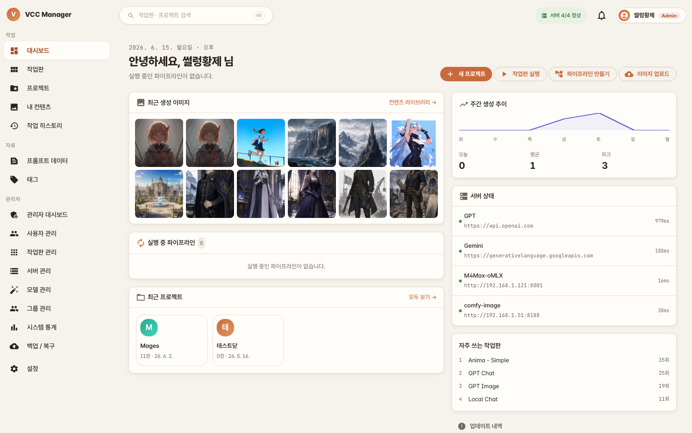
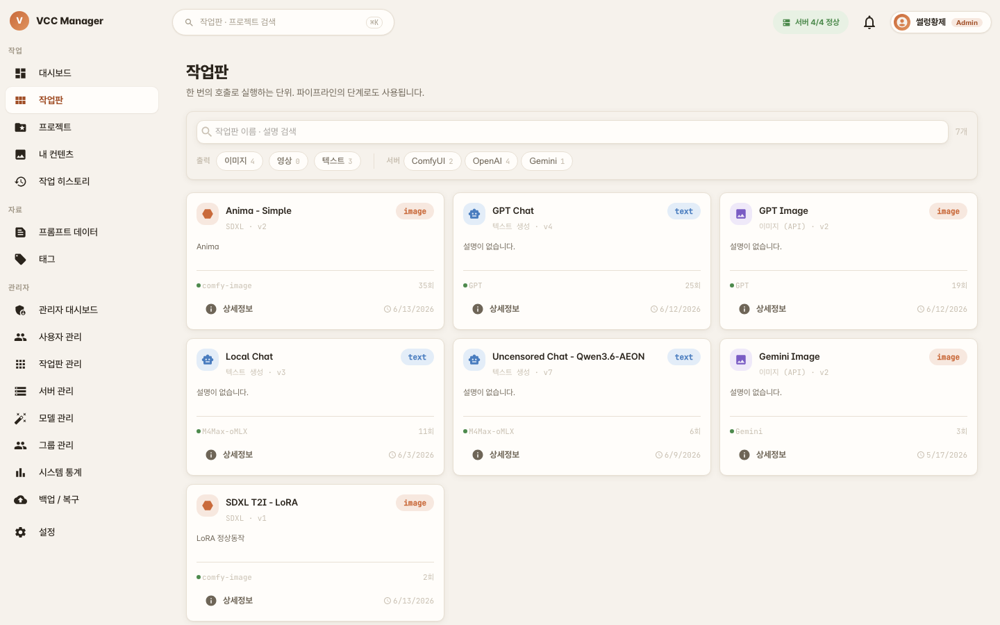
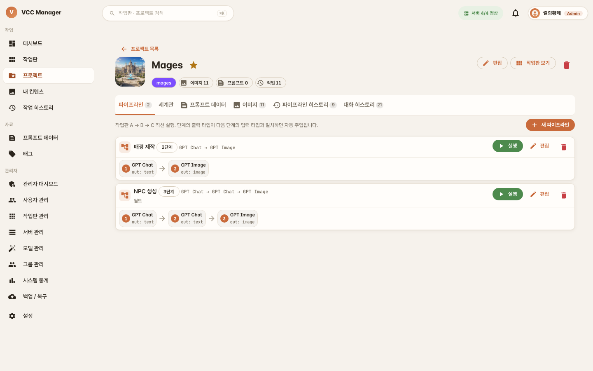

# VCC Manager 사용자 가이드

VCC Manager로 AI 이미지·비디오·텍스트를 생성하고, 프로젝트 단위로 정리하며, 작업판을 연결해 파이프라인으로 자동화하는 방법을 안내합니다.

---

## 1. 시작하기

### 계정 생성 및 로그인
1. 회원가입 후 로그인합니다. (첫 번째로 가입한 사용자는 자동으로 관리자가 됩니다.)
2. 운영 정책에 따라 관리자 승인이 필요할 수 있습니다.
3. 비밀번호를 잊었다면 로그인 화면의 "비밀번호 찾기"로 재설정 메일을 받을 수 있습니다.

### 화면 구성
로그인하면 대시보드가 열립니다. 왼쪽 사이드바로 작업판 · 프로젝트 · 내 콘텐츠 · 작업 히스토리 · 프롬프트 데이터 · 태그로 이동하고, 상단에서 검색 · 서버 상태 · 프로필을 확인할 수 있습니다. 대시보드는 그동안 만든 결과물 갤러리를 먼저 보여줍니다.

### 다크 모드
프로필/설정에서 라이트·다크 모드를 전환할 수 있습니다. 이 설정은 사용하는 기기에 저장됩니다.

---

## 2. 작업판으로 생성하기

**작업판(Workboard)** 은 생성 작업의 단위입니다. 어떤 서버(provider)와 출력 형식(이미지·비디오·텍스트)을 쓸지, 어떤 입력을 받을지가 작업판마다 정의되어 있습니다.

1. **작업판** 메뉴에서 사용할 작업판을 고릅니다. (출력 형식·서버로 필터링할 수 있습니다.)
2. 실행 화면에서 프롬프트 등 입력 양식을 채웁니다. 작업판에 기본값이 지정돼 있으면 자동으로 채워집니다.
3. **생성**을 누르면 작업이 큐에 들어가고, 완료되면 결과가 표시됩니다.
4. 생성 도중 **취소**하면 진행 중이던 외부 API 호출까지 즉시 중단됩니다.

> 이미지·비디오 작업판은 프롬프트/네거티브/시드 등을, 텍스트 작업판은 대화형 입력을 받습니다. 텍스트 작업판은 모델에 전달할 추가 옵션(JSON)을 작업판 단위로 지정할 수도 있습니다.

---

## 3. 프로젝트와 세계관

**프로젝트**는 관련 작업판과 콘텐츠를 묶는 워크스페이스입니다. 프로젝트 안에서 수행한 작업에는 프로젝트 태그가 자동으로 붙습니다.

- **세계관 문서**: 등장인물·배경·톤 같은 사전 컨텍스트를 문서로 작성해 두면, LLM(텍스트) 작업판이 이를 자동으로 참고해 답합니다. 문서를 수정하면 다음 실행부터 바로 반영됩니다.
- 프로젝트 상세 화면의 탭에서 파이프라인 · 세계관 · 프롬프트 데이터 · 이미지 · 히스토리 · 대화 기록을 한곳에서 봅니다.

---

## 4. 파이프라인

**파이프라인**은 여러 작업판을 한 줄로 연결해 한 단계의 출력이 다음 단계의 입력으로 자동 전달되도록 합니다. 예: 텍스트(장면 묘사) → 이미지 → 영상.

1. 프로젝트 상세의 **파이프라인** 탭에서 "새 파이프라인"을 만듭니다.
2. 작업판을 순서대로 단계로 추가합니다. 단계마다 사전 입력 · 메모 · (LLM 단계) 컨텍스트 문서를 설정할 수 있습니다.
3. 단계의 출력 타입이 다음 단계의 입력과 맞으면 "이전 결과 자동 주입"으로 이어집니다.
4. **실행**하면 초기 프롬프트를 입력하고 단계별 진행 상황을 볼 수 있습니다. 백그라운드로 실행되며, 중간 단계가 실패하면 그 단계부터 다시 시작할 수 있습니다.
5. 실행 이력은 "파이프라인 히스토리" 탭에서 확인합니다.

---

## 5. 프롬프트와 대화

- **프롬프트 데이터**: 자주 쓰는 프롬프트(프롬프트·네거티브·시드)를 저장해 두고 실행 화면에서 불러올 수 있습니다.
- **AI 프롬프트 생성**: 대화하듯 주고받으며(멀티턴) 프롬프트를 다듬고, 응답마다 결과 프롬프트를 받아올 수 있습니다.
- **텍스트 대화**: LLM 응답이 실시간으로 한 글자씩 나타납니다(스트리밍). 멀티모달 모델을 쓰는 작업판에서는 **이미지를 첨부**해 함께 분석하게 할 수 있고, 첨부한 이미지는 대화 기록에서 다시 볼 수 있습니다.

---

## 6. 내 콘텐츠와 히스토리

- **내 콘텐츠**: 생성한 이미지·영상과 직접 업로드한 레퍼런스 이미지를 봅니다. 검색·필터로 탐색하고, 여러 항목을 선택해 한 번에 삭제할 수 있습니다.
- **다운로드**: 뷰어에서 원본을 내려받습니다. 여러 장 생성된 항목은 썸네일로 넘겨 보며 받을 수 있습니다.
- **작업 히스토리**: 이미지·영상·텍스트·파이프라인 작업이 하나의 피드로 모입니다. 결과를 다른 작업판으로 **이어가기** 하거나, 프롬프트를 저장할 수 있습니다.
- **개인 설정**: 히스토리 삭제 시 콘텐츠도 함께 지울지, 계속하기 시 시드를 무작위로 할지 등을 설정할 수 있습니다.

---

## 7. 관리자 기능

관리자는 일반 기능에 더해 다음을 사용할 수 있습니다.

- **작업판 관리**: 작업판 생성·수정·삭제·비활성화, 내보내기/가져오기(백업)
- **서버 관리**: ComfyUI · OpenAI 호환 · Gemini 서버 등록과 상태 점검, 모델 동기화
- **사용자 / 그룹 관리**: 가입 승인, 권한 그룹으로 작업판 접근 제어
- **시스템 백업/복원**: 전체 데이터 + 미디어 백업(암호화), 복원 (복원 전 자동 스냅샷)
- **시스템 통계**: 사용량·작업 현황 모니터링

> 서버 설치·배포·운영 방법은 [배포 가이드](./DEPLOYMENT.md)를, 백업/복원 절차는 [백업/복원 가이드](./BACKUP_RESTORE.md)를 참고하세요.

---

## 8. 문제 해결

- **로그인이 안 될 때**: 관리자 승인 대기 상태인지 확인하고, 비밀번호 재설정을 시도하세요.
- **생성이 진행되지 않을 때**: 작업판에 연결된 서버 상태(상단 "서버 상태")를 확인하세요. 관리자라면 서버 관리에서 상태 점검을 실행할 수 있습니다.
- **이미지가 안 보일 때**: 새로고침(필요 시 하드 리로드) 후 다시 확인하세요.

더 자세한 내용은 [문제 해결 가이드](./TROUBLESHOOTING.md)를 참고하세요.
